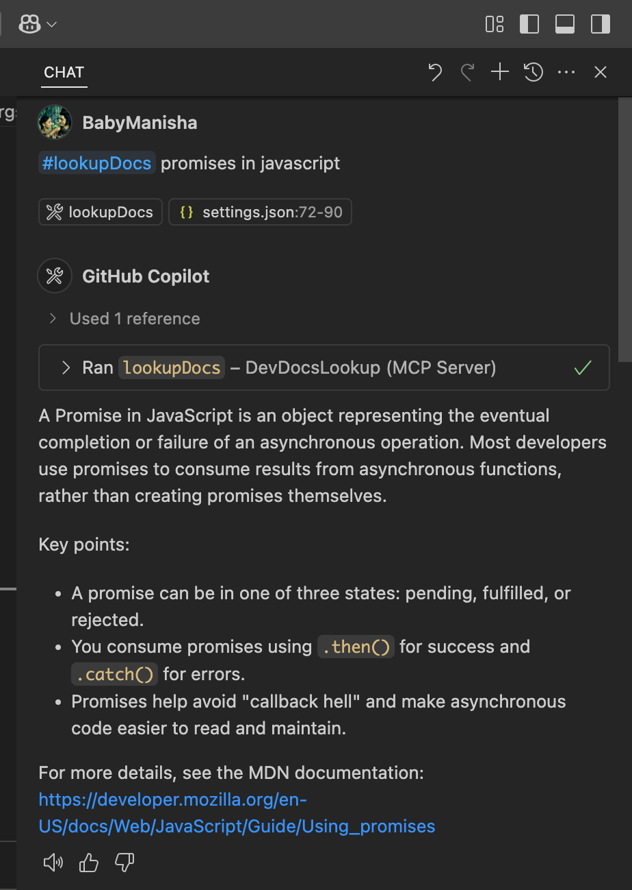
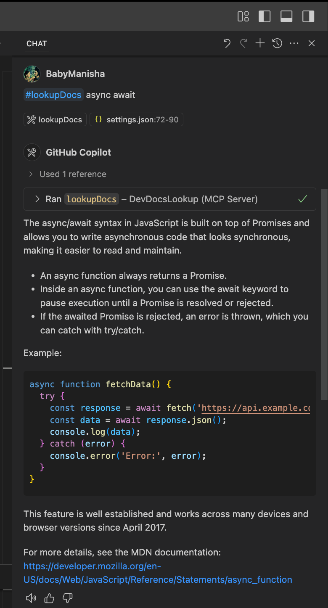
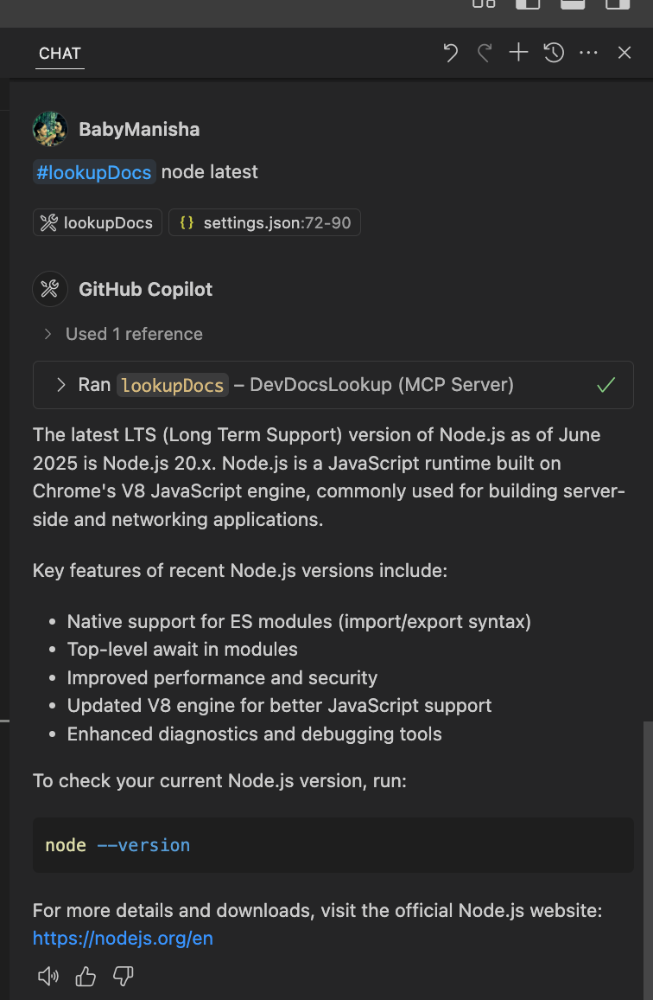
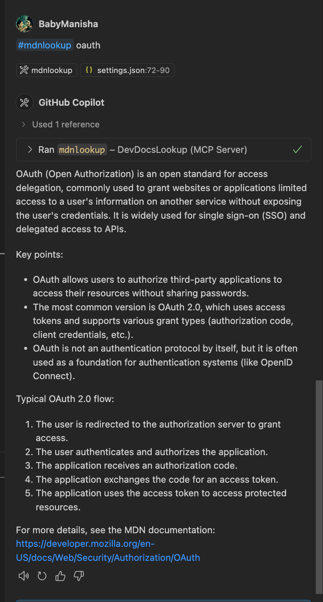

#  mdnlookup 

A tool to fetch and summarize developer documentation from [MDN Web Docs](https://developer.mozilla.org/).

**MDNlookup** is a developer productivity tool that streamlines access to [MDN Web Docs](https://developer.mozilla.org/) documentation directly from your development environment. 
Designed for seamless integration with MCP-compatible clients and editors like VS Code, mdnlookup enables developers to quickly search for and retrieve concise, relevant documentation summaries for web APIs, JavaScript methods, and other web technologies—without leaving their workflow.

By exposing an MCP-compatible tool server over stdio, mdnlookup makes it easy to automate documentation lookups and integrate them into custom toolchains or editor extensions. This helps developers save time, reduce context switching, and stay focused on coding.

## Features

- Search MDN for documentation using a query string.
- Returns a summary (first paragraph) and a link to the full documentation.
- Exposes an MCP-compatible tool server over stdio.

## Available Tools

### mdnlookup

- **Description:** Fetches and summarizes developer documentation from MDN based on a search query.
- **Parameters:**
  - `query` (string): The search term or API/method name you want documentation for.

## Installation

Clone the repository and install dependencies:

```sh
git clone https://github.com/yourusername/mdn-lookup.git
cd mdn-lookup
npm install
```

## Usage

This tool is designed to be used as an MCP tool server. You can run it directly:

```sh
node index.js
```

It will start an MCP server over stdio, ready to accept requests.

### Example: Configure in MCP Client 
```
{
  "mcpServers": {
    "SmartDeveloperAssistant": {
      "command": "node",
      "args": [
        "</absolute/path/to>/mdn-lookup/index.js"
      ]
    }
  }
}
```

VS Code (.vscode/settings.json)
``` 
"mcp": {
        "servers": {
            "mdnlookup": {
                "type": "stdio",
                "command": "node",
                "args": ["</absolute/path/to>/mdn-lookup/index.js"]
            }
        },
        "inputs": []
    },
```

## Example: Using the Tool

You can use the `mdnlookup` tool by sending a request from any MCP-compatible client:

```json
{
  "tool": "mdnlookup",
  "params": {
    "query": "Array.prototype.map"
  }
}
```

The response will look like:

```json
{
  "content": [
    {
      "type": "text",
      "text": "The map() method creates a new array populated with the results of calling a provided function on every element in the calling array.\n\nMore info: https://developer.mozilla.org/en-US/docs/Web/JavaScript/Reference/Global_Objects/Array/map"
    }
  ]
}
```

### Example Results

Below are screenshots of the tool in action for various queries:

#### Promises



#### Async/Await



#### Node.js



#### OAuth



## Configuration

No additional configuration is required. The tool uses the MDN public API and fetches documentation in English.

## License

ISC

--

Thanks

Happy Coding!!

[Baby Manisha Sunkara 👩🏻‍💻](https://babymanisha.com)

